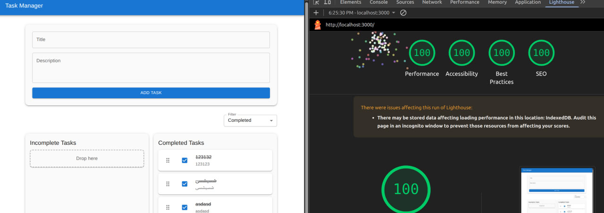

# Next.js Task Manager

A sophisticated yet simple task management application built with Next.js, featuring offline-first capabilities and high-performance metrics.


*Perfect Lighthouse scores across all metrics!*

## 🌟 Key Features


- **Real-Time Sync**: Automatically synchronizes data with backend when online
- **Drag and Drop**: Intuitive task organization with drag-and-drop interface
- **Responsive Design**: Works flawlessly across all devices
- **Offline-First Architecture**: Utilizes IndexedDB for seamless offline functionality
- **High Performance**: Perfect Lighthouse scores (100 across all metrics)

## 💡 Technical Highlights

### Offline-First with IndexedDB (not compolted)
- Leverages IndexedDB for client-side data persistence
- Non-blocking UI operations for smooth user experience
- Background sync queue for offline changes
- Automatic data synchronization when connection is restored


### Project Structure
```
├── app/
│   ├── components/         # React components
│   ├── hooks/             # Custom React hooks
│   └── globals.css        # Global styles
├── components/            # Shared components
├── constants/             # Application constants
├── lib/                   # Utility libraries
├── providers/            # React context providers
├── store/                # Redux store configuration
├── sw/                   # Service Worker logic
├── types/                # TypeScript type definitions
└── utils/                # Helper functions
```

## 🚀 Getting Started

1. **Clone the repository**
```bash
git clone [repository-url]
```

2. **Install dependencies**
```bash
npm install
```

3. **Run development server**
```bash
npm run dev
```

4. **Build for production**
```bash
npm run build
npm start
```

The application will be available at `http://localhost:3000`

## 🛠 Tech Stack

- **Framework**: Next.js with TypeScript
- **State Management**: Redux Toolkit
- **Styling**: Material-UI (MUI)
- **Storage**: IndexedDB
- **DnD**: React Beautiful DnD


## 📊 Performance

This application achieves perfect Lighthouse scores across all metrics:
- Performance: 100
- Accessibility: 100
- Best Practices: 100
- SEO: 100

## 🔒 Production Considerations

- Implements service worker for offline capabilities
- Uses IndexedDB for local data persistence
- Implements sync queue for offline operations
- Optimized for production with proper caching strategies
- Responsive design for all device sizes

